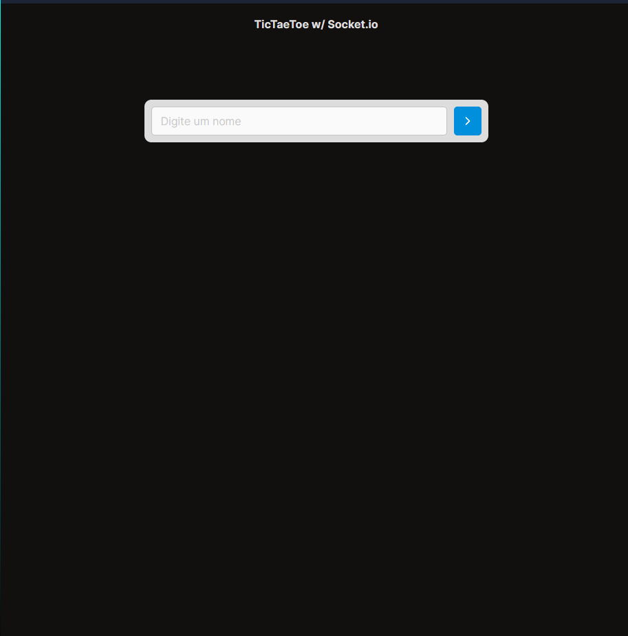
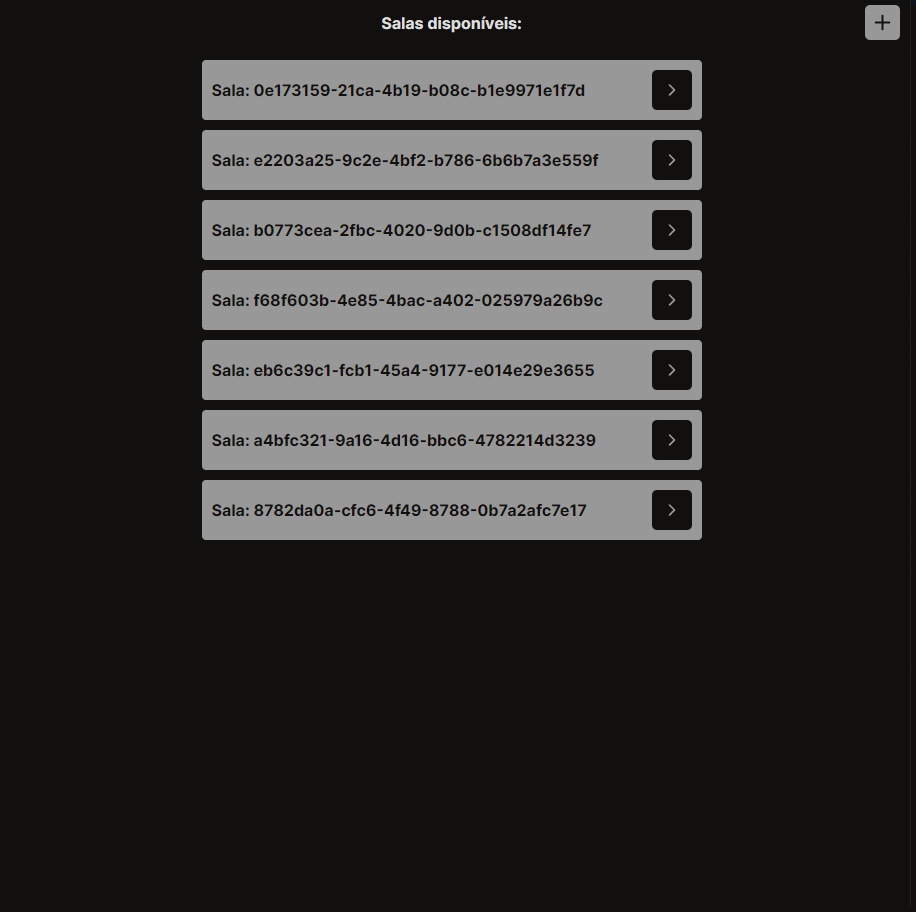
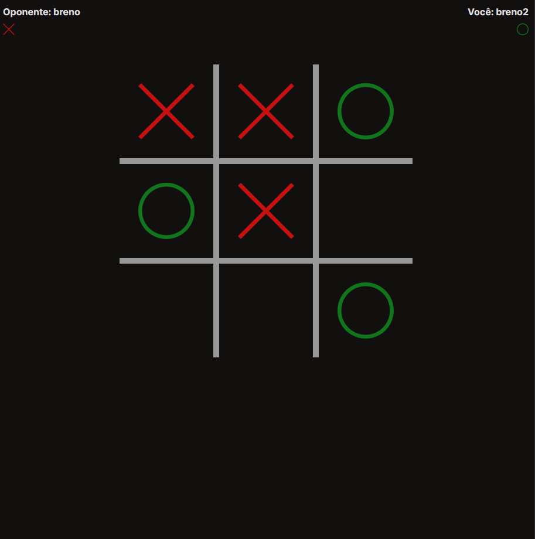
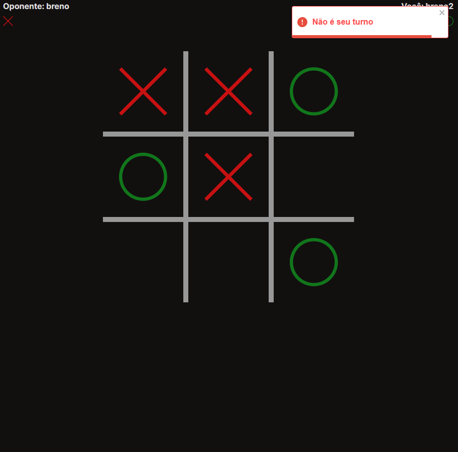
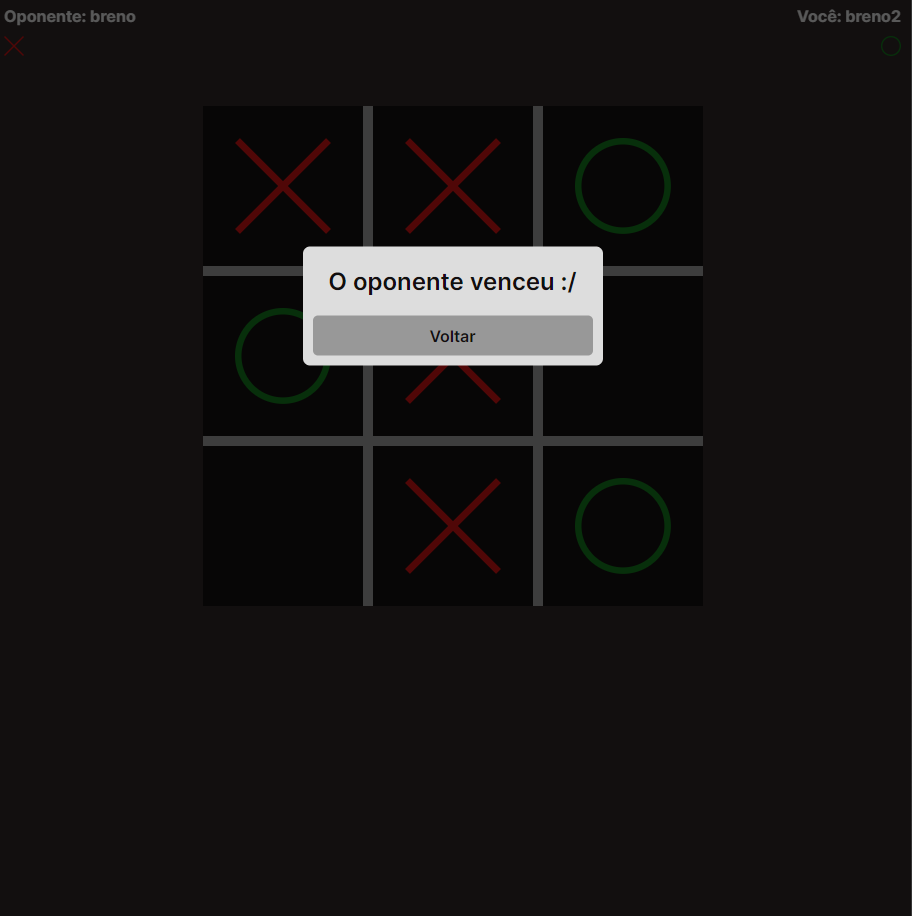
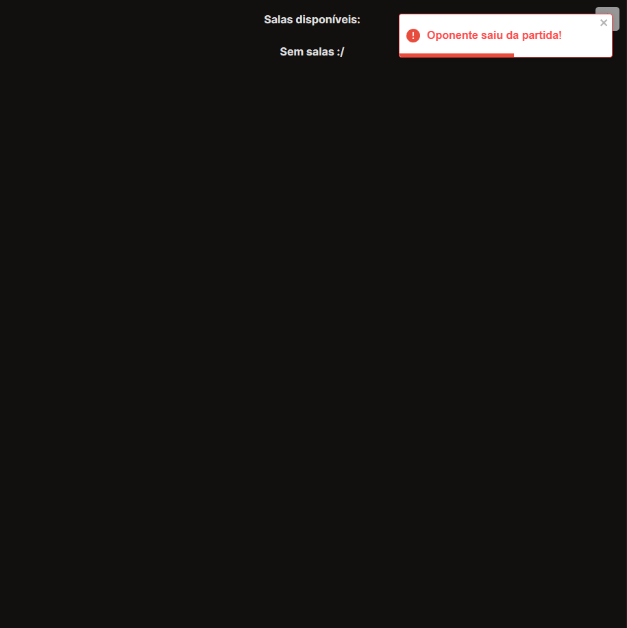

<h1 align="center">TicTacToe w/ Socket.io</h1>

Aplicação simples de um jogo da velha usando Socket.io

## :SCREEN ICON: Preview

## :rocket: Tecnologias

O projeto foi desenvolvido usando:

- [React][reactjs]
- [TypeScript][typescript]
- [Node.js][nodejs]
- [Socket.io][socketio]

[reactjs]: https://reactjs.org
[typescript]: https://www.typescriptlang.org/
[nodejs]: https://nodejs.org/en/
[socketio]: https://socket.io/pt-br/